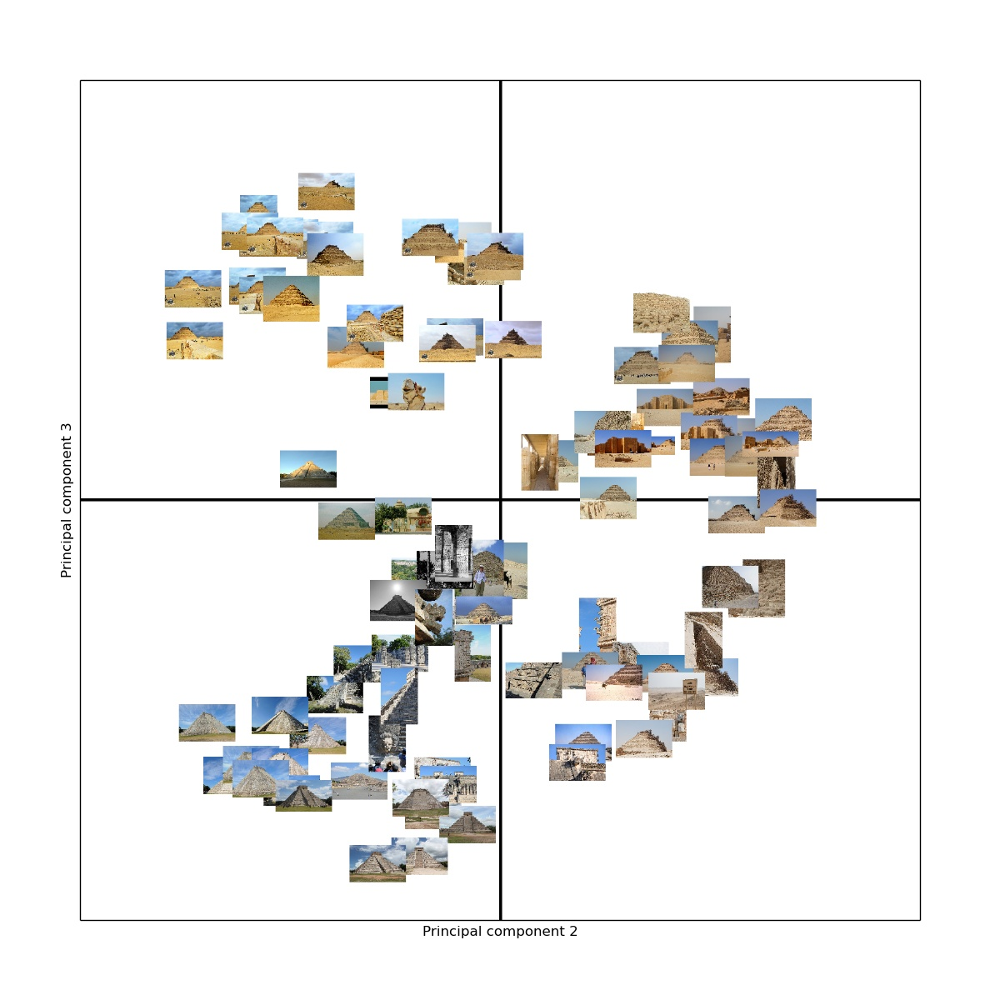

# About repstruct

Repstruct is a python library for finding representative structures in large image collections. It is implemented according to the theory of the Master's thesis [Finding reprensentative structures in large image collections](http://www2.maths.lth.se/vision/education/pages/OscarNils09/) by Oscar Lorentzon and Nils Lundahl.

The implementation extracts SIFT descriptors as well as colors from the images in the collection and creates feature vectors from histograms created by classifying the features against training data. 100 images are downloaded from Flickr for a specified tag and the results for the most representative images according to the algorithm are presented by plotting the 30 closest images and then the 5 closest.

## Running
To be able to download images from flickr.com an API key is required. An API key can be obtained from flickr.com.

The rsbundler file can be run from the command line in the following way:

	$python rsbundler.py -t <tag> -a <flickrapikey>

The API key can also be provided by adding a text file called flickr_key.txt with the API key in the root of the project. Then the bundler can be run as follows:

	$python rsbundler.py -t <tag>

To view additional bundler options run the bundler with the -h flag:
	
	$python rsbundler.py -h

## Dependencies
You need to have Python 2.7+ and the following libraries:

* [OpenCV][]
* [NumPy][]
* [SciPy][]
* [Matplotlib][]
* [Enum34][]

[OpenCV]: http://opencv.org/ (Computer vision and machine learning software library)
[NumPy]: http://www.numpy.org/ (Scientific computing with Python)
[SciPy]: http://www.scipy.org/ (Fundamental library for scientific computing)
[Matplotlib]: http://matplotlib.sourceforge.net (Plotting in python)
[Enum34]: https://pypi.python.org/pypi/enum34 (Enum support in python 2.*)

## Example output

The images below show the result from a run using the tag **steppyramid.** The first output image shows the collection images plotted against their feature vector projection onto the third and fourth principal component. 

The second output image shows the result after running the algorithm. On top all collection images are shown, in the middle the thirty closest images are shown and at the bottom the five most representative images are shown.

